# Beeston Castle Website

This website is aimed at potential and returning visitors to Beeston Castle in the county of Cheshire in the United Kingdom. The aim of the website is to provide information for users wishing to find out more about the history of Beeston Castle and for those who want to visit the castle. There is also a sign up newsletter which enables users to be kept abreast of developments at the castle.

The purpose of the project is to demonstrate knowledge of how to produce a user friendly, responsive website using HTML and CSS.

[Link to live website](https://nickcmoore.github.io/beeston-castle/)

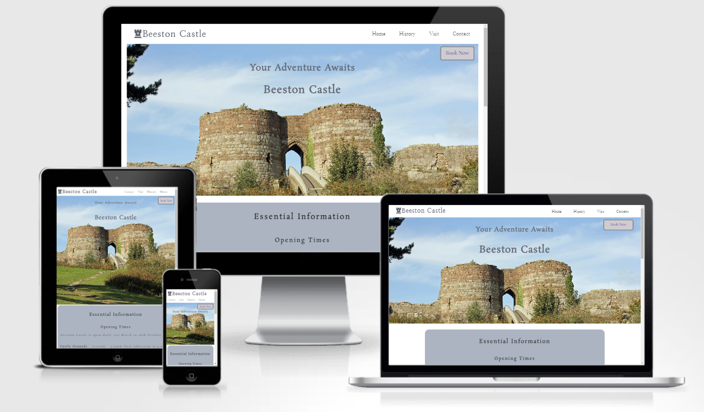

## Contents

* [**User Experience UX**](<#user-experience-ux>)
    * [User Stories](<#user-stories>)
* [**Design**](<#design>)
    * [Wireframes](<#wireframes>)
    * [Colour Scheme](<#colour-scheme>)
    * [Typography](<#typography>)
* [**Technologies Used**](<#technologies-used>)
* [**Testing**](<#testing>)
* [**Current Features**](<#current-features>)
    * [Common Features](<#navigation-menu>)
    * [Home Page](<#home-page>)
    * [History Page](<#history-page>)
    * [Visit Page](<#visit-page>)
    * [Contact Page](<#contact-page>)
* [**Deployment**](<#deployment>)
    * [Deploying](<#deploying>)
    * [Forking](<#forking>)
    * [Cloning](<#cloning>)
* [**Credits**](<#credits>)
    * [Code](<#code>)
    * [Content](<#content>)
    * [Media](<#media>)
    * [Design](<#design-credits>)
    * [Acknowledgements](<#acknowledgements>)

* [**Future Features**](<#future-features>)
* [**Acknowledgements**](<#acknowledgements>)

## User Experience (UX) 

### User Stories 

**First Time Visitor Goals**

* As a first time visitor, I want to understand the main purpose of the site and learn more about the castle.
* As a first time visitor, I want to be able to easily navigate throughout the site to find content.
* As a first time visitor, I want to be able to easily plan a trip to the castle in advance. Therefore, I should be able to find out information such as how best to visit the castle and ticketing costs.
* As a first time visitor, I would like to access social media content about the castle, including content from the castle owners and also third parties.
* As a first time visitor, I want to find out background information about the history of the castle in a presentable format.
* As a first time visitor, I want to be able to contact the castle owners to ask any further personal queries about visiting the castle.

**Returning Visitor Goals**

* As a returning visitor, I want to find out the latest information about visiting the castle.
* As a returning visitor, I want to build on my existing knowledge of the history of the castle with updated historical facts.
* As a returning visitor, I want to find the best way to get in contact with the castle owners with any new questions I may have.
* As a returning visitor, I want to be able to easily access social media links which contains any new updates.

**Frequent User Goals**

* As a frequent user, I want to check to see if there is any updated important visitor information or if ticket prices have changed.
* As a frequent user, I want to see if any new historical information about the castle has been published on the website.
* As a Frequent User, I want to sign up to the Newsletter so that I am emailed any major updates and/or changes to the website or castle.

## Design 

**Wireframes** 

I used [Balsamiq](https://balsamiq.com/) to create wireframes for the various pages in the site.

*Home page*

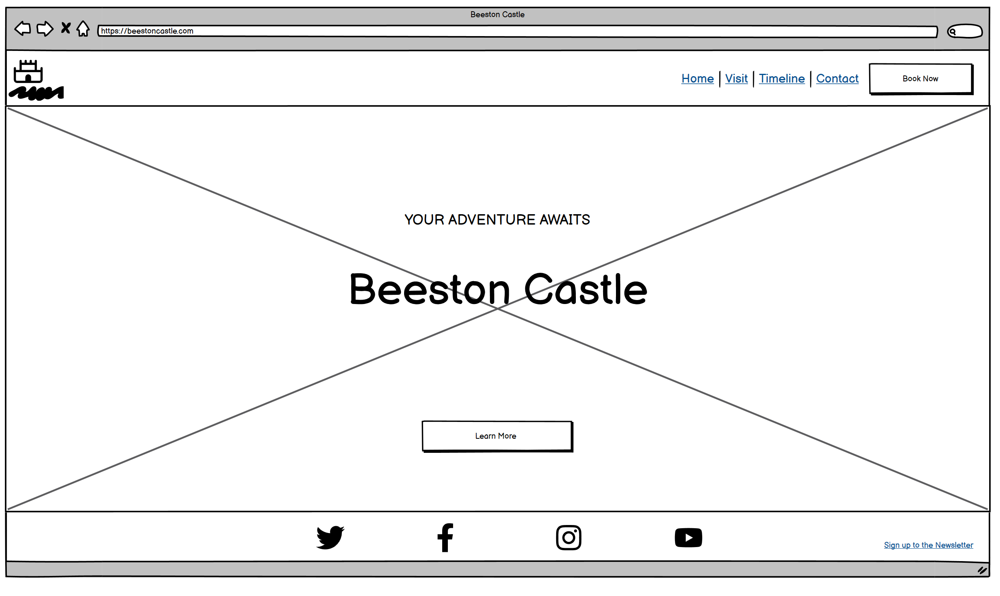

*History page*

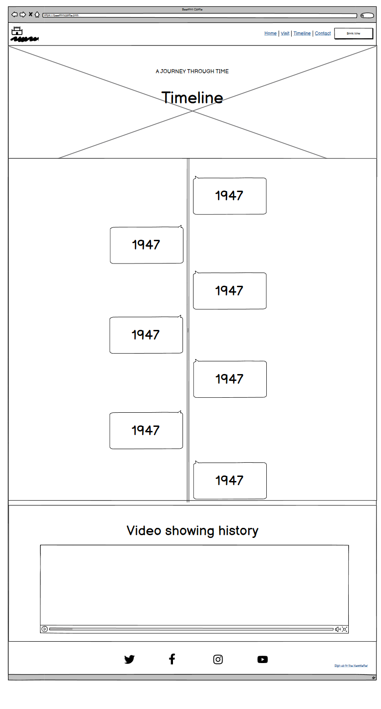

*Visit page*

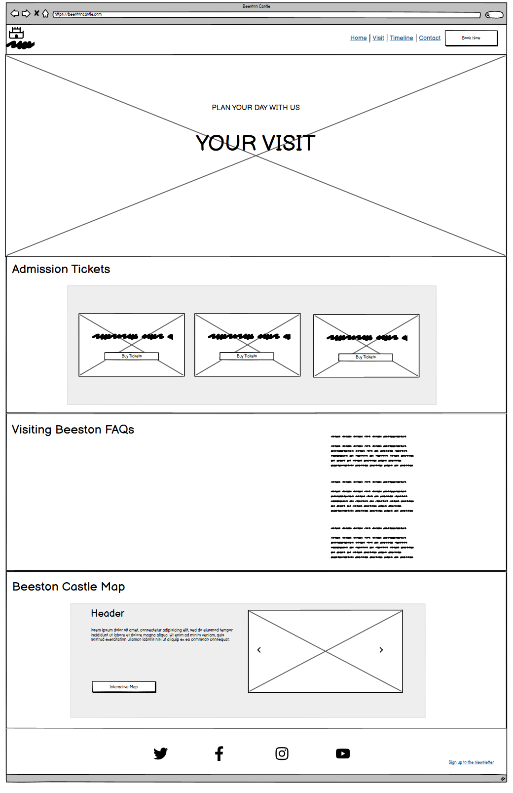

*Contact page*

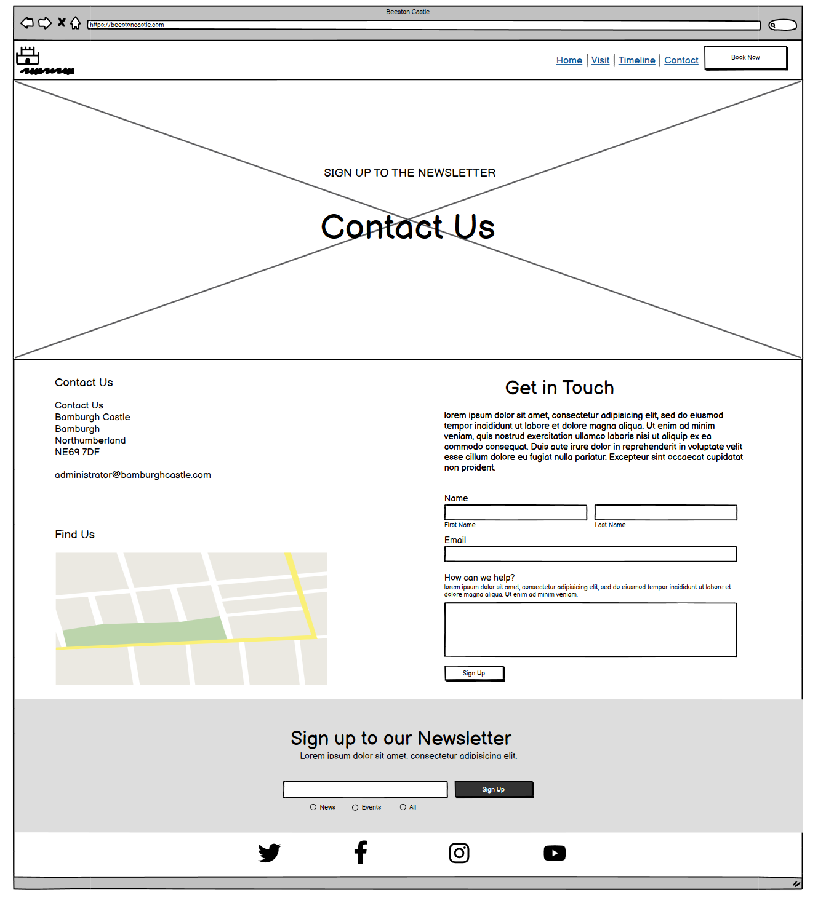

**Colour Scheme** 

By using the [Coolors](https://coolors.co/1c2321-7d98a1-5e6572-a9b4c2) website, I was able to select a colour palette that would be suitable for all users and visually appealing.

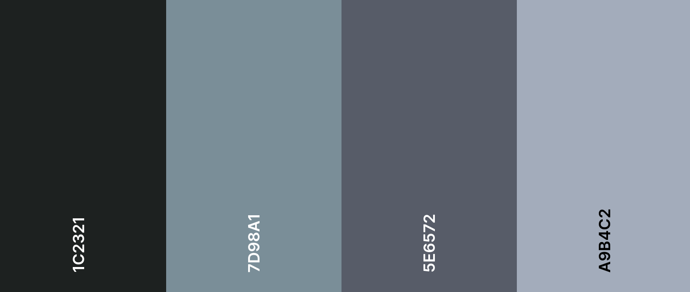

**Typography** 

Google Fonts was used to select a blend of fonts which would compliment each other and be accessible for all.

Rosarivo was used for all headers and the logo text

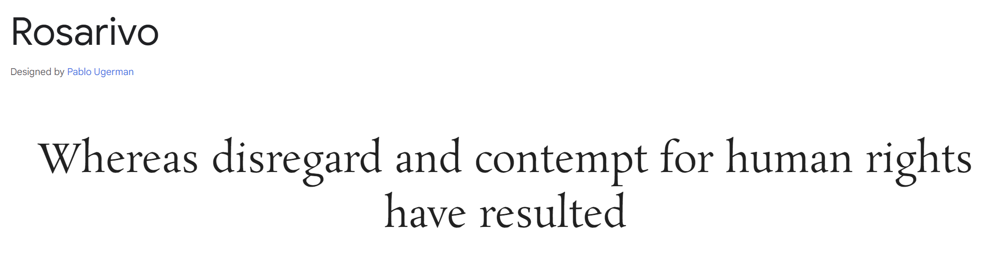

Nanum Myeongjo was used the body text.

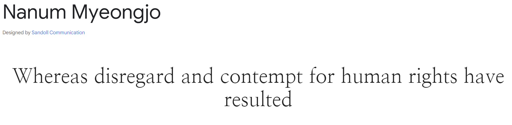

Montserrat & Lato were also used to provide a more contemporary contrast to the more traditional Rosarivo & Nanum Myeongjo styles.

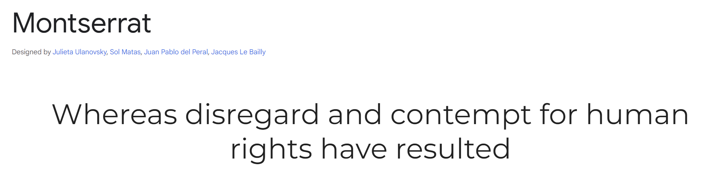

Lato

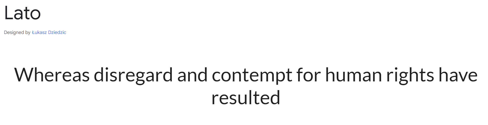

## Technologies Used 

* [HTML5](https://en.wikipedia.org/wiki/HTML5) - HTML5 used to generate the site structure.

* [CSS3](https://en.wikipedia.org/wiki/CSS) - CSS3 used to implement styling for the website.

* [Github](https://github.com/) - GitHub was used to store, manage, track and control code changes for the website.

* [Gitpod](https://www.gitpod.io/) - Gitpod was used for website deployment.

* [Balsamiq](https://balsamiq.com/) - Balsamiq was used to generate initial wireframes for the project.

* [VSCode](https://code.visualstudio.com/) - VSCode was used to build and edit the source-code for the website.

## Testing 

For a detailed breakdown of testing, please see [Testing](https://github.com/NickCMoore/beeston-castle/blob/main/TESTING.md) file.

## Current Features ## 

### Common Features ### 

* __Navigation Section__

    * This section runs across all pages and provides a simple way to navigate through the key sections of the site. The logo was taken from a Font Awesome logo and was chosen for its simplicity.

    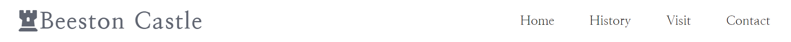

* __Footer Section__

    *Across the bottom of every page is a footer which containers Font Awesome links to the main social media channels.

    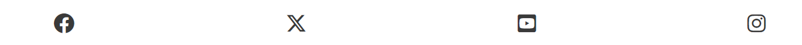

### Home Page ### 

* __Main Image and text__

    * The image is meant to draw the user in by showing the profile of the castle. The text reiterates the site name and also encourages the user that they are on an adventure with the strapline. There is also a call to action button on the right hand side to make it easy for users who wish to make bookings on the site.

    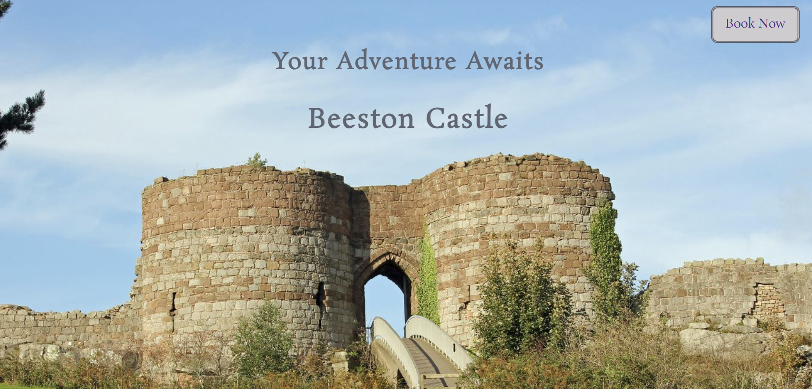

* __Essential Information__

    * This section is to enable users to quickly access key information that they need about Beeston Castle. This information includes opening times, the castle location and contact details for the castle. The grey colour background links to that of the navigation menu and heading text. I wanted this section to seem like a printed card and be in a bitesize format.

    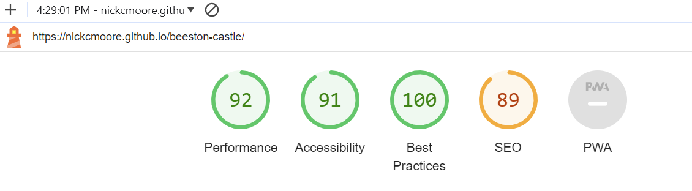

* __Subscribe Form__

    * To enable users to keep up to date with news and events at the castle, I included a newsletter subscription form at the bottom of the home page. This also means the castle can quickly get subscribers signed up and involved. The form is designed to deliberately be simple and continues the muted color palette from earlier in the home page.

    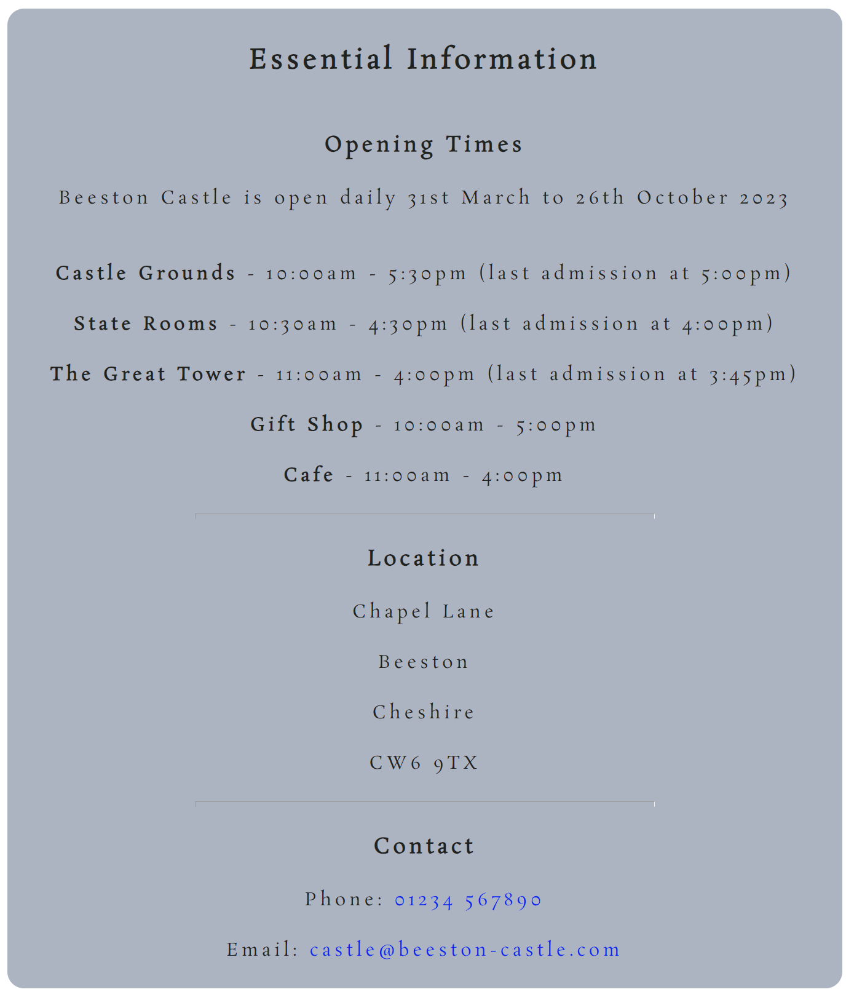

### History Page ### 

* __History Image and Text__

    * This image and text has a similar purpose to the homepage, in that it is intended to draw the user in and make them feel like they would be going on an adventure by visiting the site. The banner text "A Journey Through Time" is meant to capture this. Stylistically, the section has a consistent format and layout to the homepage.

    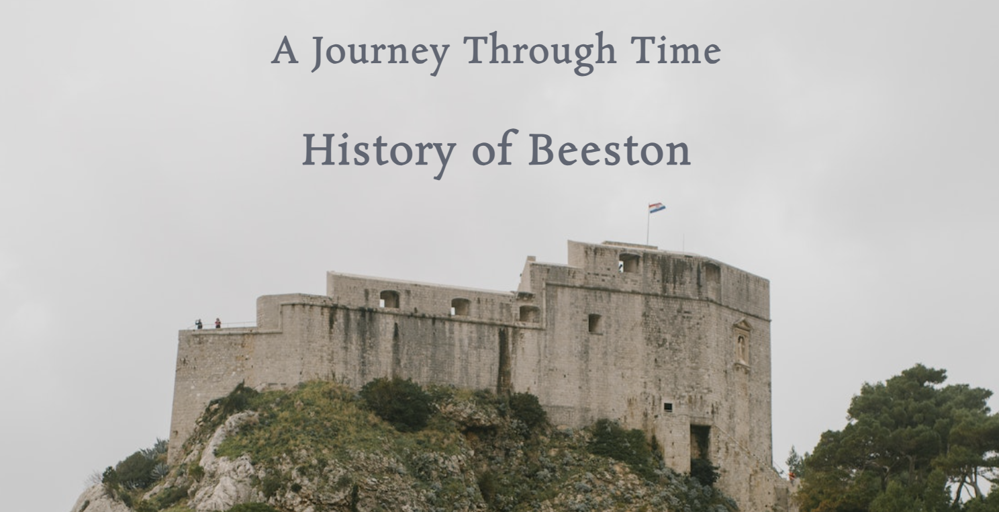

* __Timeline__

    * The timeline is designed for those users who visit the site wanting to find out more about the historical background behind the castle. The styling stays consistent with the colour palette and layout of the previous pages. It gives a simple short overview of the key events in the castle's history.

    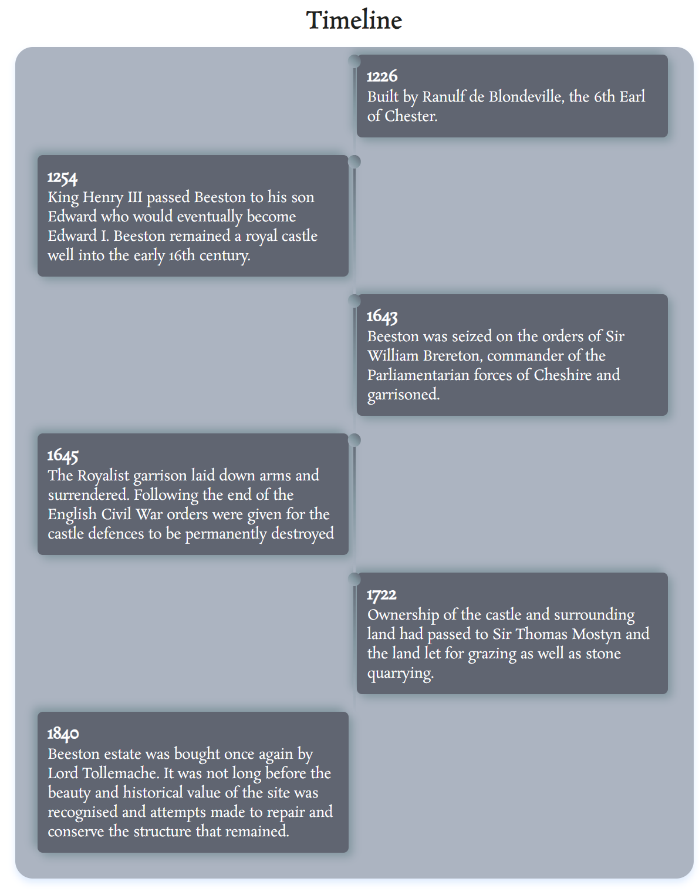

* __Castle Video__

    * This video has been included to help users visualise what it would be like to visit the castle. It draws users in with the drone footage of the castle and intentionally follows on the from the timeline section. Now that they have the history of the castle, they can appreciate this more by viewing the video.

    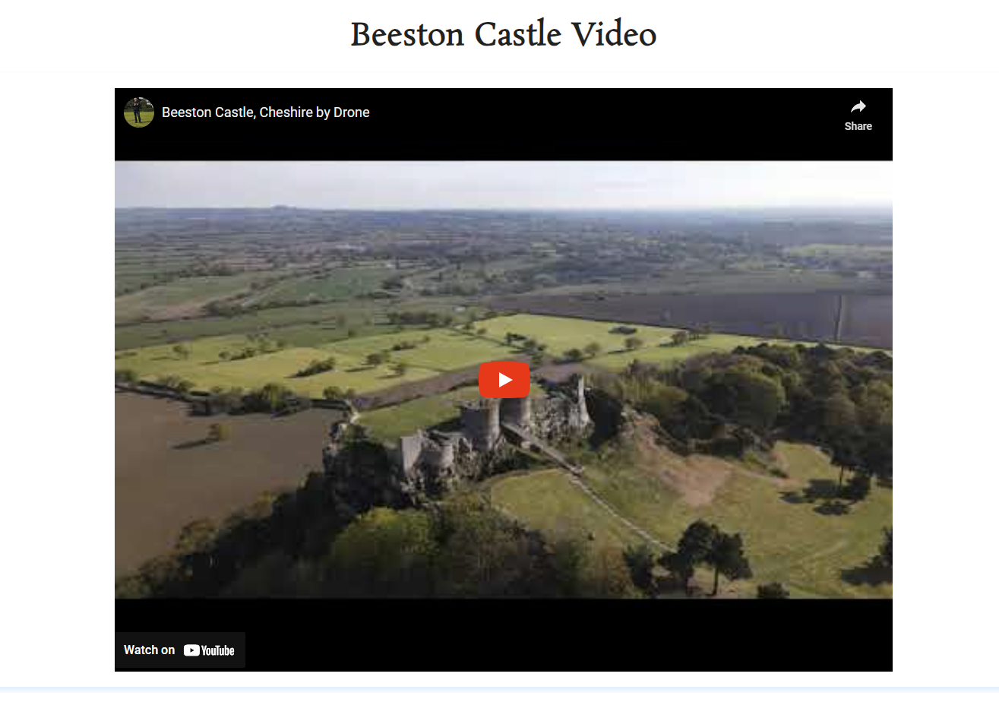

### Visit Page ### 

* __Visit Image and Text__

    * The image is meant to be consistent with the previous pages in terms of style and layout, but presents the castle in a more relaxed light with the sunset image. The text is designed to indicate that 'as a team' we can plan your visit to the castle.

    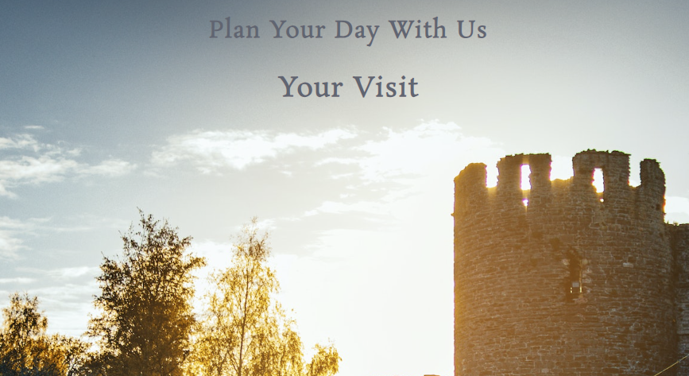

* __Tickets__

    * Users can easily click on the ticket types in this section. It was designed to be as simple as possible with only 3 ticket types. On clicking the ticket, users are taken to a ticket confirmation landing page. Photos used are meant to be representative of the differing age group. I wanted to keep the tickets all on one row for ease of comparison and accessibility.

    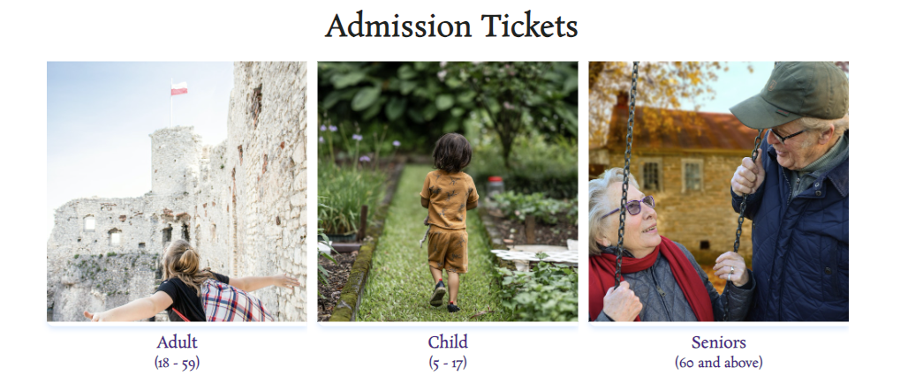

* __FAQs__

    * If users have any common questions at all about visiting the castle, they can see it in this section. I could've included more FAQs, but I wanted to keep it as simple as possible and immediately after the ticket section. The font style and format follows the previous pages.

    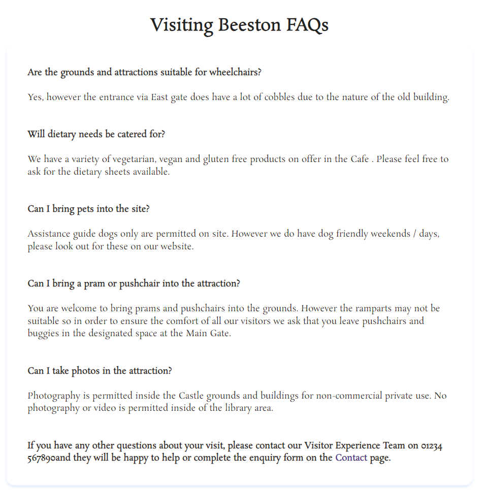

* __Map__

    * On the Visit page I felt it was important to have a map of the castle location which could be manipulated easily and enable users to plan their journeys in advance.

### Contact Page ### 

* __Contact Image and Text__

    * Once again, the image is meaant to echo that of the previous pages in terms of layout, house style and theme.

    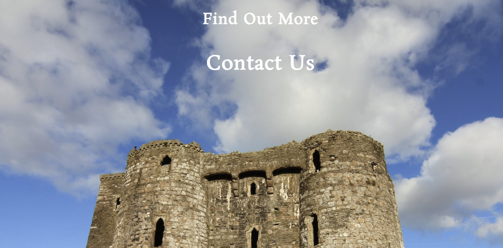

* __Contact Form__

    * This form enables users to request further information or submit any queries to the castle. Upon completion of the form, users are taken to a thank you for your enquiry landing page. The style echos that of the previous sections. The background image is actually a map of the castle and is just visible behind the contact form. The idea of translucent forms is consistent with that of the home page newsletter form.

    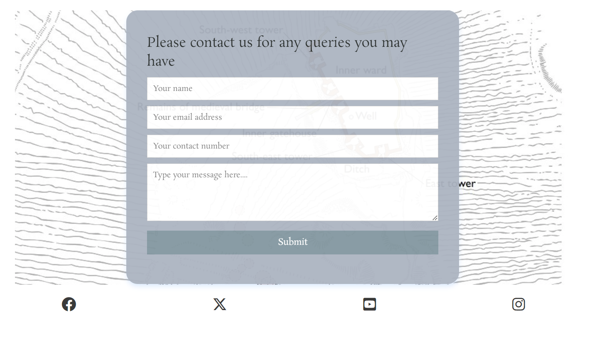

## Deployment 

### Deploying The Project 

The site was deployed to GitHub pages. The steps to deploy a site are as follows:

* In the GitHub repository, navigate to the Settings tab.
* Once in Settings, navigate to the Pages tab down the side menu.
* Under Source, select the branch to master, then click save.
* Once the master branch has been selected, the page will be automatically refreshed with a detailed ribbon display to indicate a successful deployment.
* The GitHub repository live link is here - [Beeston Castle](https://github.com/NickCMoore/beeston-castle)

### Forking The Repository Using GitHub 

A copy of the GitHub Repository can be made by forking the GitHub account. This copy can be viewed and changes can be made to the copy without affecting the original repository. Take the following steps to fork the repository:

* Log in to **GitHub** and locate the repository.
* On the right hand side of the page inline with the repository name is a button called **'Fork'**, click on the button to create a copy of the original repository in your GitHub Account.

### Creating A Local Clone Of The Project 

The method from cloning a project from GitHub is below:

* Under the repository’s name, click on the **Code** tab.
* In the **Clone with HTTPS** section, click on the clipboard icon to copy the given URL.
* In your IDE of choice, open **Git Bash**.
* Change the current working directory to the location where you want the cloned directory to be made.
* Type **git clone**, and then paste the URL copied from GitHub.
* Press **Enter** and the local clone will be created.

## Credits 

### Code 

* Code for the footer section was adapted from [Code Institute's](https://codeinstitute.net/global/) Love Running walkthrough project.
* The Timeline section is based on [code](https://codepen.io/Divyesh-K/pen/YzxLQNz) written by [CodePen](https://codepen.io/) author Divyesh Kamalanaban

### Content 

* Content for the FAQs section was abridged from the [Lincoln Castle](https://www.lincolncastle.com/plan/faqs) website.
* The Timeline section explaining the history of Beeston Castle is based on research from [Great British Life](https://www.greatbritishlife.co.uk/things-to-do/23153457.look-history-beeston-castle-cheshire/) 

### Design 

* [Balsamiq](https://balsamiq.com/) - was used to generate the wireframes for the project.
* The colour palette for the site was chosen with accessibility in mind from the [Coolors](https://coolors.co/1c2321-7d98a1-5e6572-a9b4c2) site.
* The following fonts used throughout the site and were imported from Google Fonts - Montserrat, Rosarivo, Nanum Myeongjo and Lato.

### Media 

* The main logo and social media links were taken from [Code Awesome's](https://fontawesome.com/) database of icons.

* Photos used were either from the Pexels website or Matt Thomas' [Flickr](https://www.flickr.com/photos/31045971@N00/14983599442/in/photolist-oQ3S6q-24hyGAe-aqYY9J-d5jqtU-9Q1khz-UGBtKt-pY8FnR-H89oWt-28sxMfH-aBmcc6-8pA8wE-pXY6XJ-Uv52QB-J6icyv-8wRs3W-WGjCme-Uv53XB-c9kiM3-Usj7MG-d5jzyw-HUbuLj-TuRRMr-eie29i-cUGBkA-25Gz6eq-VqmJaq-gndmoS-CtJqBM-q1aKEa-9tMDQw-inXC4L-a6GaDa-e2MzK9-UCXFBE-9uRiDk-4qo9V-Lu39Sa-bkjPHH-Ek8FmM-PRV5an-3dKTbL-MkH3hJ-8wRtMN-FuF1eU-cz6tnd-NBmdVW-fCghAV-RxnzDP-gndEPM-oxhAuj) page (with permission).

### Acknowledgments 

* My mentor, Jack Wachira, for his continious helpful feedback.
