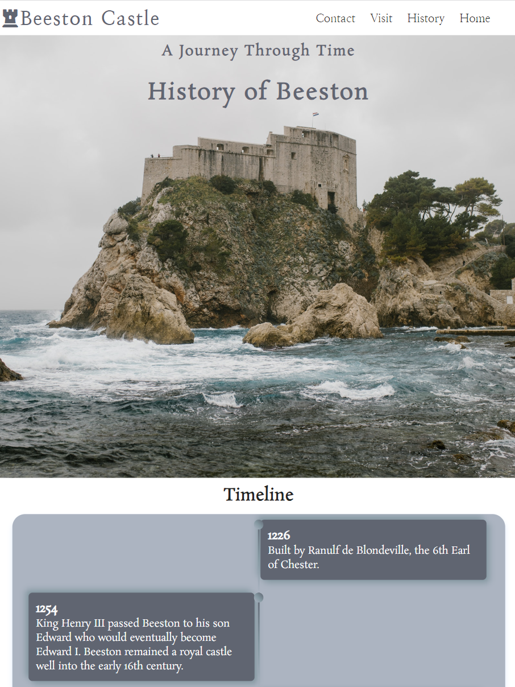
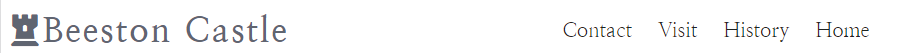
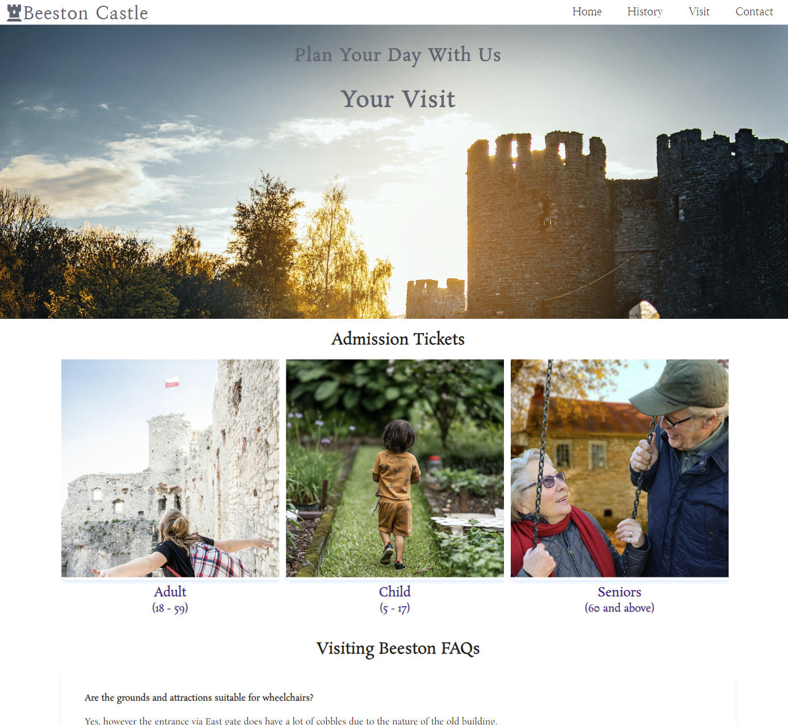
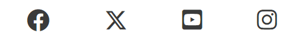
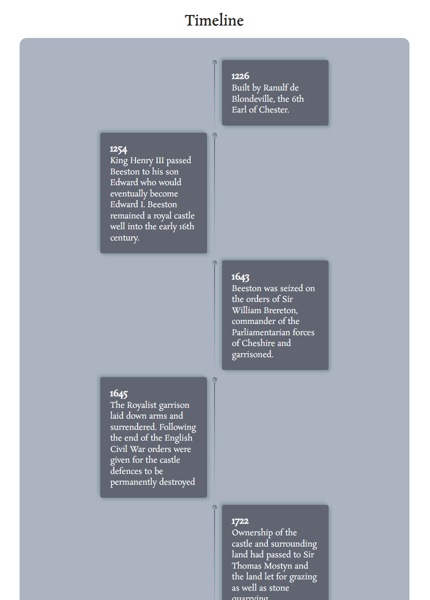
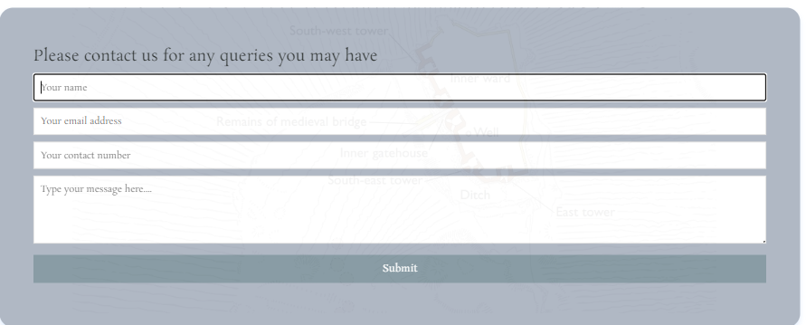
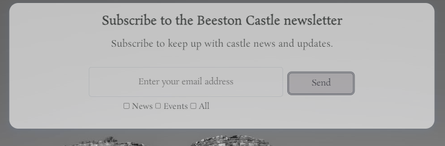
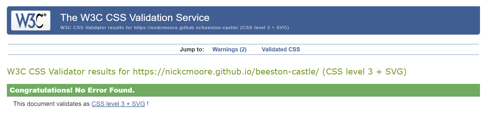
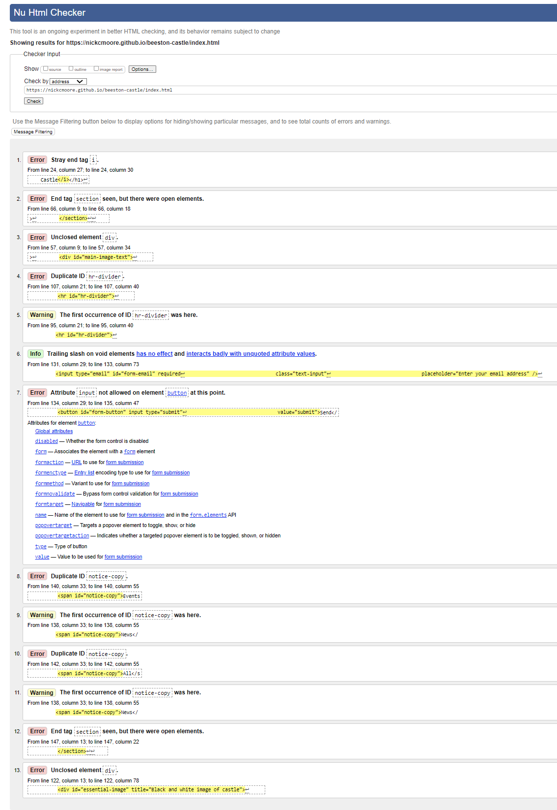
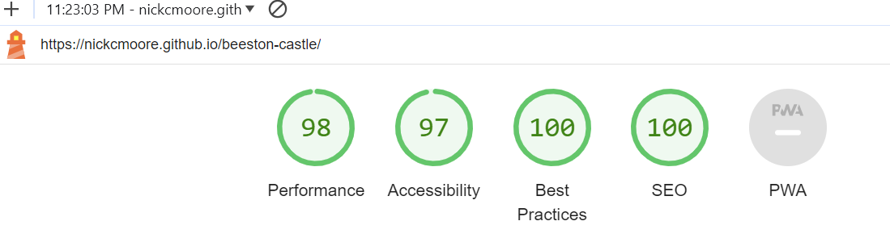

# __Testing__ #

## Table of Contents

* [**User Testing**](<#user-testing>)
    * [Testing User Stories](<#testing-user-stories>)
* [**Browser Testing**](<#browser-testing>)
    * [Testing User Stories](<#testing-user-stories>)
         * [First Time Visitor Goals](<#first-time-visitor-goals>)
         * [Returning Visitor Goals](<#returning-visitor-goals>)
         * [Frequent Visitor Goals](<#frequent-visitor-goals>)
* [**Compatability and Responsiveness Testing**](<#compatability-responsiveness-testing>)
* [**Code Validation Testing**](<#code-validation-testing>)
    * [W3C HTML Validator Results](<#w3c-html-results>)
    * [W3C CSS Validator Results](<#w3c-css-results>)
* [**Bugs**](<#bugs>)
    * [Resolved](<#resolved-bugs>)
    * [Unresolved](<#unresolved-bugs>)
* [**Further Testing**](<#known-bugs>)

## User Testing  
I sent a deployed link to the website to many family members and friends who provide constructive feedback and also simulated the various user cases (listed at the beginning of the Readme document) who might visit the site. This testing gave me an opportunity to see how the website would perform on a range of devices. No major display and navigation issues were encountered.

### Testing User Stories from User Experience (UX) Section 

* __First Time Visitor Goals__ 

    * As a first time visitor, I want to understand the main purpose of the site and learn more about the castle. By accesing the home page, it helps me to understand the reasoning behind the site. If I want to learn more about the castle, from the homepage, I click on History and then will be able to access the timeline which gives a historical overview of the site.

    

    * As a first time visitor, I want to be able to easily navigate throughout the site to find content. To navigate through the site, the user can click on the links in the navigation menu and also on the Beeston Castle icon to return to the home page.

    

    * As a first time visitor, I want to be able to easily plan a trip to the castle in advance. Therefore, I should be able to find out information such as how best to visit the castle and ticketing costs. To do this, a user can click on the Visit link and then easily find out this information.

    

    * As a first time visitor, I would like to access social media content about the castle, including content from the castle owners and also third parties. Easily accessible social media links are included in the footer of every page for users.

    

    * As a first time visitor, I want to find out background information about the history of the castle in a presentable format. If I want to learn more about the castle history, from the homepage, I click on History and then will be able to access the timeline which gives a historical overview of the site.

    

    * As a first time visitor, I want to be able to contact the castle owners to ask any further personal queries about visiting the castle. If I want to contact the castle owners, from the homepage, I click on Contact in the Navigation Menu and then will be able to access a contact form where I can submit my query.

    

* __Returning Visitor Goals__ 

    * As a returning visitor, I want to find out the latest information about visiting the castle. To do this, from the homepage, I click on the Visit link in the Navigation Menu and then the information will be presented to me.

    

    * As a returning visitor, I want to build on my existing knowledge of the history of the castle with updated historical facts.  If I want to learn more about the castle history, from the homepage, I click on History and then will be able to access the timeline which gives a historical overview of the site.

    

     * As a returning visitor, I want to find the best way to get in contact with the castle owners with any new questions I may have. If I want to contact the castle owners, from the homepage, I click on Contact in the Navigation Menu and then will be able to access a contact form where I can submit my query.

    

    * As a returning visitor, I want to be able to easily access social media links which contains any new updates. Easily accessible social media links are included in the footer of every page for users.

    

* __Frequent Visitor Goals__ 

    * As a frequent user, I want to check to see if there is any updated important visitor information or if ticket prices have changed. To do this, from the homepage, I click on the Visit link in the Navigation Menu and then the latest visitor information will be presented to me.

    

    * As a frequent user, I want to see if any new historical information about the castle has been published on the website. If I want to find out if any castle history has been added to the site, from the homepage, I click on History and then will be able to access the timeline which gives a historical overview of the site.

    

    * As a Frequent User, I want to sign up to the Newsletter so that I am emailed any major updates and/or changes to the website or castle. From the home page, I scroll down to the bottom of the page and enter my email address in the newsletter submission form and this will enable me to subscribe to the latest newsletter.

    

## Browser Testing 
The website was tested by myself on a range of modern browsers including Chrome, Edge, Brave and Firefox. Load times were quick and no specific issues were encountered during this phase of testing.

## Compatability and Responsiveness Testing 
The website was tested on various monitors including a 27 inch monitor (3840 x 2160), a laptop (1920 x 1080), an iPhone 13 Pro (390 x 844) and an iPad (1536 x 2048). All media queries coded in CSS executed correctly when required.

I also tested the website at different resolutions throughout the build process on Google Chrome Dev Tools. The following simulated devices were tested on Dev Tools - Galaxy Fold (280 x 653), iPhone 12 Pro (390 x 844), iPad Air (820 x 1180). In Dev Tools, I also tested the devices at the following common resolutions - 1280 x 720 (HD), 1920 X 1080 (FHD), 2560 X 1440 (QHD) and 3840 X 2160 (4K).

To double check the responsiveness and use an alternative to Dev Tools, I used the [Responsive Design Checker](https://www.responsivedesignchecker.com/) site to test all of the above resolutions.

## Code Validation Testing 
The website was run through both the [W3C HTML Validator](https://validator.w3.org/) and the [W3C CSS Validator](https://jigsaw.w3.org/css-validator/).

### W3C HTML Validator Results 
Further details on all bugs can be found in the Bugs section.

[Home Page](https://nickcmoore.github.io/beeston-castle/index.html) - following on from this testing, the home page had 9 errors and 3 warnings.

[History](https://nickcmoore.github.io/beeston-castle/history.html) - following on from this testing, the History page had 1 error.

[Visit](https://nickcmoore.github.io/beeston-castle/visit.html) - following on from this testing, the Visit page had 1 error.

[Contact](https://nickcmoore.github.io/beeston-castle/contact.html) - following on from this testing, the Contact page had 1 error.

### W3C CSS Validator Results 
No errors were found using this CSS valildator.

## Bugs 

### Resolved 

During the build phase of the project, I resolved a number of bugs encountered with the site. These resolved bugs were recorded in GitHub Commit messages.

I performed HTML Validation testing on the site and found the following errors with the home page.

* Error: Stray end tag i. From line 24, column 27; to line 24, column 30 - removed
* Error: End tag section seen, but there were open elements. From line 62, column 5; to line 62, column 14 - added closing 
 tag
* Error: Unclosed element div. From line 57, column 9; to line 57, column 34 - linked to bug 2 (added 
 tag)
* Error: Duplicate ID hr-divider. From line 103, column 21; to line 103, column 40 - changed from ID to a Class
* Error: Bad value tel:01234 567890 for attribute href on element a: Illegal character in scheme data: space is not allowed. From line 107, column 31; to line 107, column 57 - added spacing to the a element. 
* Error: Attribute input not allowed on element button at this point. From line 132, column 29; to line 133, column 47 - removed 'input' wording from submit section.
* Error: Duplicate ID notice-copy. From line 140, column 33; to line 140, column 55 - changed these from ID to classes.
* Error: End tag section seen, but there were open elements. From line 145, column 13; to line 145, column 22 - added missing 
 to code.
* Error: Unclosed element div. From line 118, column 13; to line 119, column 56 - linked to the above, Added missing 
 tag.

The same 1 remaining error occurred across all of the other site pages and was as follows:

* Error: Stray end tag i. - this tag was removed from the HTML Header in the remaining pages.

Upon resolving these errors in the W3C Validators, no further errors remain.

### Unresolved 

* Some CSS code which has been formatted correctly in VS Code, the alignment of some CSS properties are unintentionally indented when it appears in GitHub. Spoke with mentor about this and we were unable to resolve the bug.
* The Book Now CTA button on the home page does not work on smaller mobiles. The same is the case for the Facebook link in the footer. Mentor tried and was unable to resolve this. (UPDATE - now resolved)
* Email address box in the Subscribe form goes beyond the container edge in the smallest mobile resolutions.
* Order of the navigation menu links to the other pages switches around at mobile resolutions.

## Further Testing 

To further validate the website from a performance, accessibility, best practices and SEO perspective, I ran the site through the Lighthouse testing suite in Google Chrome Dev Tools.

The results were as follows:

Click [here](https://github.com/NickCMoore/beeston-castle/blob/main/TESTING.md) to return to the ReadMe file.
