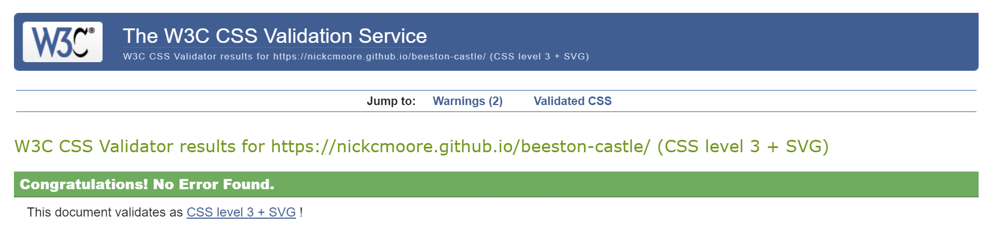
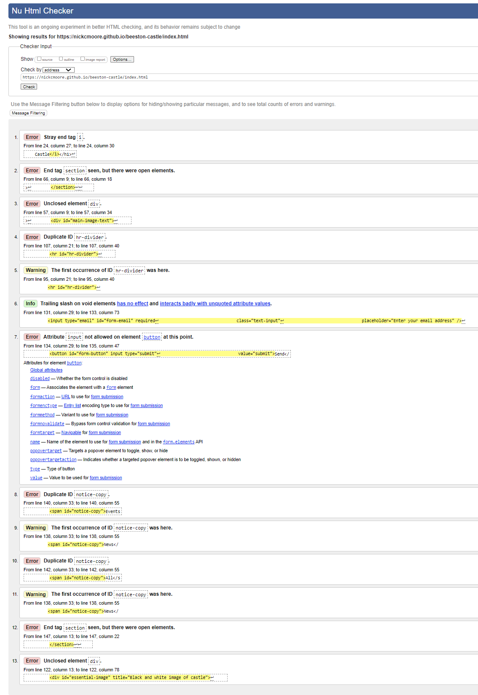

## User Testing
I sent a deployed link to the website to many family members and friends who provide constructive feedback and also simulated the various user cases (listed at the beginning of the Readme document) who might visit the site. This testing gave me an opportunity to see how the website would perform on a range of devices. No major display and navigation issues were encountered.

### Testing User Stories from User Experience (UX) Section

* First Time Visitor Goals

* Returning Visitor Goals

* Frequent Visitor Goals

## Browser Testing
The website was tested by myself on a range of modern browsers including Chrome, Edge, Brave and Firefox. Load times were quick and no specific issues were encountered during this phase of testing.

## Compatability and Responsiveness Testing
The website was tested on various monitors including a 27 inch monitor (3840 x 2160), a laptop (1920 x 1080), an iPhone 13 Pro (390 x 844) and an iPad (1536 x 2048). All media queries coded in CSS executed correctly when required.

## Code Validation Testing
The website was run through both the [W3C HTML Validator](https://validator.w3.org/) and the [W3C CSS Validator](https://jigsaw.w3.org/css-validator/).

### W3C HTML Validator Results
Further details on all bugs can be found in the Bugs section.

Home Page - following on from this testing, the home page had 9 errors and 3 warnings.

History - following on from this testing, the History page had 2 errors.

Visit - following on from this testing, the Visit page had 1 error.

Contact - following on from this testing, the Contact page had 1 error.

### W3C CSS Validator Results
No errors were found using this CSS valildator.

## Known Bugs

**Resolved**

## Further Testing ###

To further validate the website from a performance, accessibility, best practices and SEO perspective, I ran the site through the Lighthouse testing suite in Google Chrome Dev Tools.

The results were as follows:

Click [here](https://github.com/NickCMoore/beeston-castle/blob/main/TESTING.md) to return to the ReadMe file.
